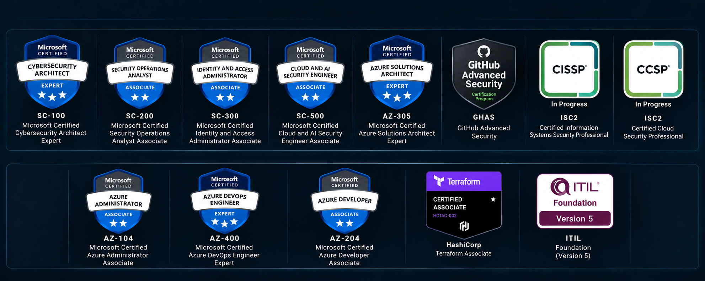

  

## 🧭 About Wahba  
I'm a Cloud Security Architect at Microsoft and Security Architecture & Engineering Leader with 12+ years of experience across cloud security, DevSecOps, SRE, platform engineering, and enterprise cloud architecture:
- 🔐 **40 enterprise cloud security assessments** delivered across global customer environments
- 🛡️ **150+ security misconfigurations and control gaps** identified and guided through remediation
- 📈 **Microsoft Secure Score improved from approximately 40% to 95% on average** across assessed customer environments
- ⚠️ **70% average reduction in high-priority security findings** through risk-based remediation and security hardening
- 🧭 **Security architecture and advisory** across Zero Trust, IAM, Microsoft Defender, Microsoft Sentinel, Microsoft Purview, and cloud governance
- ⚙️ **12+ years of engineering experience** spanning cloud security, DevSecOps, SRE, platform engineering, and multi-cloud architecture
- 👥 **Leadership at scale**, including DevOps CoP/CoE leadership, engineering mentorship, and platforms supporting 300,000+ users

## 📦 [AION](https://github.com/AIOps-Vision) Organization:
- [📘 **Mastering Basics in C++ for Beginners**](https://github.com/AIOps-Vision/Mastering-Basics-in-Cpp-for-Beginners)
- [📱 **Shop-all E-Commerce App**](https://github.com/AIOps-Vision/Shop-all-E-Commerce-App)
- [🛠️ **Production-Grade DevOps Challenges**](https://github.com/AIOps-Vision/Production-Grade-DevOps-Challenges)
- [🧠 **Cloud-Fundamentals**](https://github.com/AIOps-Vision/Cloud-Fundamentals)

## 📈 GitHub Stats

## 💻 Languages & Engineering Stats

